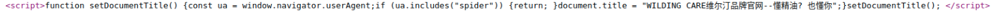

# 网站篡改检测（WebsiteTamperingDetector）

## 功能说明

对批量输入的网站进行篡改检测。
由于IP在中国大陆境外的网站域名可能是过期后被赌博色情等网站注册使用，故仅关注IP在大陆境内的网站。

## 环境要求

1. Python3
2. pip3 install -r requirements.txt
3. ChromeDriver & Chrome

## 使用方法

1. 将需要检测的网站域名写入input.txt文件中
2. python3 main.py
3. 检测完成后结果将输出到output.xlsx文件中

## 支持检测的篡改特征

- UA判定型JS代码
1. 类型一 
2. 类型二 
3. 类型三 
4. 类型四 
5. 类型五 
6. 类型六 

- 代码混淆型JS代码
1. 类型一 
2. 类型二 
3. 类型三 
4. 类型四 
5. 类型五 
6. 类型六 
7. 类型七 
8. 类型八 

- 特定结构HTML代码
1. 类型一 
2. 类型二 
3. 类型三 
4. 类型四 

## 准确率

使用input.txt中的1万个域名进行测试，经人工验证，准确率约为96%
（2024年8月测试，仅验证IP在中国大陆境内的网站，IP在大陆境外的网站仅供参考）。

## 依赖的项目

IP是否在中国大陆境内的判定数据来自[17mon/china_ip_list](https://github.com/17mon/china_ip_list)，
程序首次运行时会从该项目下载数据，后续直接使用保存的数据文件。

## 开源协议

GPL-3.0
